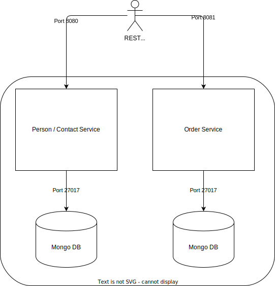

# Celonis Programming Challenge: Frontend Specialist

Dear applicant,

Congratulations, you made it to the Celonis Programming Challenge!

Why do we ask you to complete this challenge?

First of all, we need to have some way of comparing different applicants, and we try to answer certain questions which we can not out-right ask in an interview - also we don't want to ask too many technical questions in a face-to-face interview to not be personally biased in a potentially stressful situation. To be as transparent as possible, we want to give you some insights into what we look at and how we evaluate. This challenge gives you the possibility to shine :). Impress us with **simplicity**, understanding of your own solution and of course **working code**.

## Challenge

The following challenge has to be solved. You will find specific tasks and deliverables in the subsequent sections.

Note that there is nothing wrong with googling when you have certain questions or are unsure about some APIs, but you should not outright copy code that you don't understand. If you decide to copy code, please mark it as copied citing the source.

## Challenge: Implementation

What we are looking into:

- Clean, simple and understandable code 
- Analytical / problem-understanding / problem-solving skills
- Ability to execute / implement 
- Ability to explain why you picked a certain solution and why you rejected possible alternatives
- Ability to challenge proposed solutions (business wise and technically) and identify more efficient or better ways forward

## Task 1: Get the sample application "Up and Running"

The sample application are two very simple microservices that manage persons/contacts and orders. The services are "dockerized" and come with a [docker-compose file](docker-compose.yaml) that helps you set it up quickly. To run it you need docker (incl. compose) and an internet connection. 

You start the application it with `docker-compose up -d`. This will create the following setup:

Both Applications expose a REST API that is described with an OpenAPI 3.0 compliant specification:

* [Person/Contact Service](assets/contact_service_openapi.yaml)
* [Order Service](assets/order_service_openapi.yaml)

This specification is also available on the running service under [http://localhost:8080/swagger-ui/ for Person/Contact Service](http://localhost:8080/swagger-ui/) and [http://localhost:8081/swagger-ui/ for Order Service](http://localhost:8081/swagger-ui/).

Both services technically independent (no connection) but logically coupled. After all it is persons who place orders.

Your task is to explore the APIs to create, change and delete contacts and orders. Basically get to know your base services. 

Congrats! Now you are ready to begin the actual development work!

## Task 2: Create a Frontend

In this task you can excite us with your frontend skills. Build a frontend for the 2 services that let users capture orders for contacts. Since the 2 services are not integrated in the backend, you need to ensure consistency on the frontend side. You are entirely free in your technology choices, css styles, etc. However we expect you to reason about them. 

Since we enjoy good and robust designs, the services by default don't support [CORS](https://en.wikipedia.org/wiki/Cross-origin_resource_sharing). However you can switch it on by setting `--spring.profiles.active=CORS` on both services on the [compose file](docker-compose.yaml).  

In order to not overcomplicate things:

* You don't need to do excessive error handling, however please explain where you compromised and how you would do it properly
* No need for automated tests
* If you think certain ideas are too much effort to implement, just explain them
* Don't spend too much time on calculations or other side aspects that would usually happen in the services. 
* We know there is no set product catalog, just work around it...

## Task 3: Make it robust (Best Effort)

This is a best-effort task. This means there is no right or wrong, just more or less potential. If you spent a lot of time to get here, feel free to skip. 

By now you should have a good user experience up and running. Now its time to look at the non-functional aspects of frontend development. The services sometimes have latency issues. You can simulate this by changing the `--api.maxArtificialLatency` command of the in the [compose file](docker-compose.yaml). After changing this, don't forget to restart the services. Try to create an experience that hides this as good as possible.

Also as the service becomes more and more successful, the list of contacts explodes. Try to mitigate this in your frontend. To simulate the explosion of contacts you can adjust the `--dataload.numberOfPersons=10` parameter of the `contact-service` in the compose [compose file](docker-compose.yaml). After changing this, don't forget to restart the services.

## Task 4: Containerize your Frontend

Until now your code sits on your computer. In this task you will liberate it and make it portable. You will do this by creating a [Dockerfile](https://docs.docker.com/engine/reference/builder/) and integrating your frontend into the [compose file](docker-compose.yaml). Please be aware that this will change the meaning of `localhost` (for details please see the [documentation](https://docs.docker.com/compose/networking/)).

Should you have enabled CORS for development purposes, this is the time to disable it. Also make sure you tell us how you got rid of it in the challenge interview ;-).

You can also take a step back and think how you would serve your UI in a cloud environment. This is also a good talking point for the interview.

## Task 5: Presentation

Congratulations you have completed the technical part of your challenge. Now you need to sell it to us ;-). For that we would expect the following to be handed in once your deadline is expired:

* Word document summary 3-4 pages max. highlighting: Architecture ([original architecture is available as drawio](assets/Architecture.drawio)), choices made and reasons, proposed improvements, what worked and what not, etc.
* Complete Source Code 
* Amended docker-compose file (to re-create your setup on our own infrastructure)

During the meeting we would follow the below structure:

* Demo of your Solution: Be creative and entertain us
* Joint discussion of your previously handed-in word document
* Presentation of your source code structure with questions and answers
* Open Questions that will mainly ask you for reasons of choices you made (framework, css, etc.). It is very important to be honest here. If you picked Angular as a framework because it is the only one you know, don't make up things just say it. 
